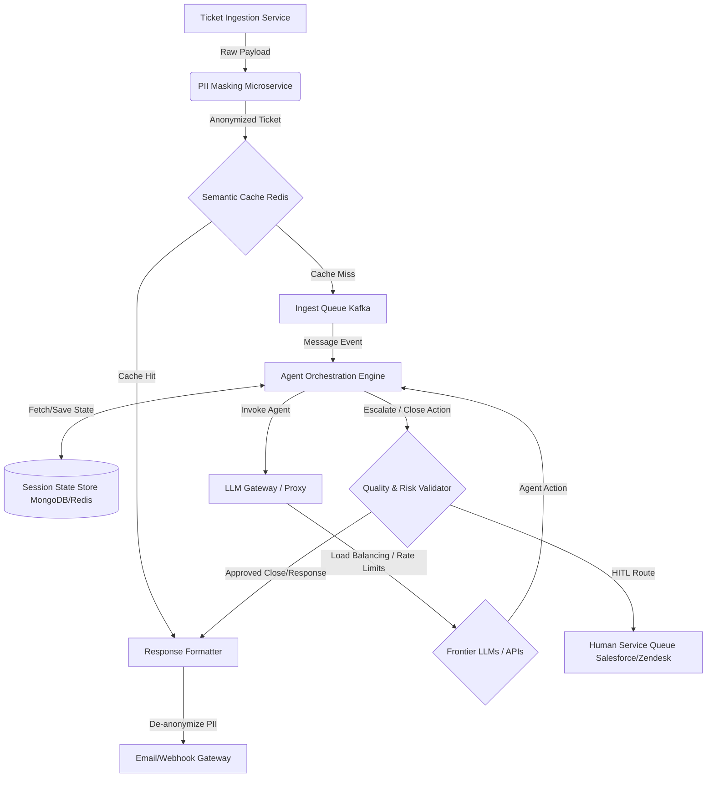

# Production System Design Specification: SupportOps at Scale

This document outlines the production architecture required to scale the SupportOps agent environment to enterprise-grade workloads (handling **10,000+ support tickets per minute** under strict security, SLA, and reliability constraints).

---

## 1. System Requirements

### Functional Requirements
* **Asynchronous Ticket Intake**: Ingest tickets from multiple sources (Email, Zendesk, Intercom, Webhooks) and queue them for processing.
* **PII Anonymization**: Automatically redact personally identifiable information (PII) before forwarding payloads to external LLM APIs.
* **Stateful Dialogue Resolution**: Conduct multi-turn customer dialogues (up to 12 turns) with persistent memory.
* **Human-in-the-Loop (HITL) Escalation**: Safely route high-complexity, high-risk, or failing interactions to human support queues.

### Non-Functional Requirements
* **Throughput**: Support a peak load of $150\text{ tickets/second}$ ($10,000\text{ tickets/minute}$).
* **Latency**: 
  * PII Masking overhead: $< 50\text{ ms}$.
  * Cache hit response time: $< 100\text{ ms}$.
  * End-to-end agent step decision: $< 2.5\text{ seconds}$ (primarily bounded by LLM inference).
* **Security & Compliance**: SOC2 Type II, GDPR, and HIPAA compliance. No unencrypted PII must be transmitted over the internet or stored in LLM logs.
* **Fault Tolerance**: Fall back to heuristic routing and human queues if LLM APIs experience downtime.

---

## 2. High-Level Architecture

The following diagram illustrates the flow of a customer ticket through the production agent architecture:



---

## 3. Core Component Specifications

### 3.1 PII Masking & De-identification Pipeline
To maintain strict compliance, customer data must be scrubbed of PII (names, phone numbers, credit card details, API keys) before being passed to external API gateways.

1. **Named Entity Recognition (NER)**: A local CPU-optimized microservice running a custom **Spacy** model or **Microsoft Presidio** parses the ticket body.
2. **De-identification mapping**: PII fields are replaced with cryptographically secure placeholder tokens (e.g., `Jane Smith` $\rightarrow$ `{{USER_NAME_1}}`, `jane.smith@email.com` $\rightarrow$ `{{EMAIL_1}}`).
3. **Token Store**: The mapping is saved in a short-lived Redis session store (TTL = 24 hours).
4. **Re-identification**: When the agent generates a final customer response, the Response Formatter replaces placeholders with original values from the Redis Token Store before sending the message.

### 3.2 Semantic Caching with Vector DB
Repeated queries (e.g., password resets, invoice download requests) make up to 40% of helpdesk volume. Invoking LLM reasoning for identical queries is slow and expensive.

* **Sentence Embeddings**: Incoming ticket subjects and bodies are converted to 384-dimensional dense vectors using a lightweight local model (e.g., `all-MiniLM-L6-v2`) hosted on an ONNX runtime container (latency $< 10\text{ ms}$).
* **Vector Index (Redis Stack / Pinecone)**: Perform a cosine similarity search against recently resolved tickets.
* **Cache Threshold**: 
  * If similarity score $\ge 0.95$, retrieve the corresponding historical resolution trajectory and repeat the action (direct Cache Hit).
  * If similarity $< 0.95$, treat as a Cache Miss and forward to the processing queue.

### 3.3 Asynchronous Agent Broker (Kafka + Celery/Temporal)
Because agent loops require multiple steps (e.g., Route $\rightarrow$ Set Urgency $\rightarrow$ Respond $\rightarrow$ Wait for Customer $\rightarrow$ Close), they cannot run inside synchronous HTTP request threads.

* **Ingestion Queue (Apache Kafka)**: Tickets are ingested as events. Partition keys are set to `ticket_id` to guarantee that all events for a single conversation are processed sequentially by the same consumer group.
* **State Management (Redis + MongoDB)**: A persistent session store tracks the agent's environment state:
  ```json
  {
    "session_id": "abc-123-xyz",
    "status": "AWAITING_CUSTOMER_REPLY",
    "step_number": 4,
    "current_department": "billing",
    "history": [
      {"sender": "Customer", "text": "I was double charged."},
      {"sender": "Agent", "text": "Let me check that for you."}
    ]
  }
  ```
* **Execution Engine (Temporal.io Workflow)**: Workflows orchestrate the state transitions. If an agent calls `RESPOND`, the workflow goes into a `Sleep` state waiting for an external customer webhook event (representing the customer follow-up message) before waking up to execute the next step.

### 3.4 LLM Gateway & Failover Manager
To protect the system from rate limits ($429\text{ errors}$) and server outages, we place an intelligent proxy (e.g., LiteLLM or Kong Gateway) between the workers and LLM APIs.

* **Semantic Routing**: Low-complexity tickets (complexity $< 0.4$) are automatically routed to cheap, fast models (e.g., `gpt-4o-mini`, `gemini-2.0-flash`). High-complexity tickets are routed to `claude-3-5-sonnet`.
* **Token Bucketing**: Maintains sliding window counters of token consumption to prevent hitting provider rate limits.
* **Fallbacks**: If the primary endpoint fails 3 consecutive times, the gateway automatically routes queries to a fallback provider (e.g., from OpenAI to Azure OpenAI, or from Anthropic to Amazon Bedrock).

### 3.5 Quality & Risk Validator (Guardrails)
Before any action is pushed to production databases or customer channels, it passes through an automated validation layer:

1. **Tone & Alignment Check**: The dual-signal grader scoring logic runs asynchronously. If the response quality falls below $0.6$, the event is blocked.
2. **Escalation Rules**: If the urgency is set to `critical` or the action is `escalate`, the system bypasses automatic closure and spawns a ticket in Zendesk for human agents.
3. **Audit Logger**: All masked outputs, rewards, and step transitions are written to an immutable cold storage audit log (S3 Glacier) for regulatory audit and model reinforcement training.
